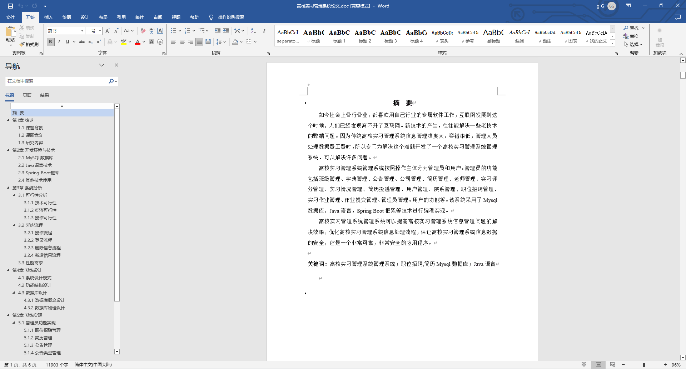
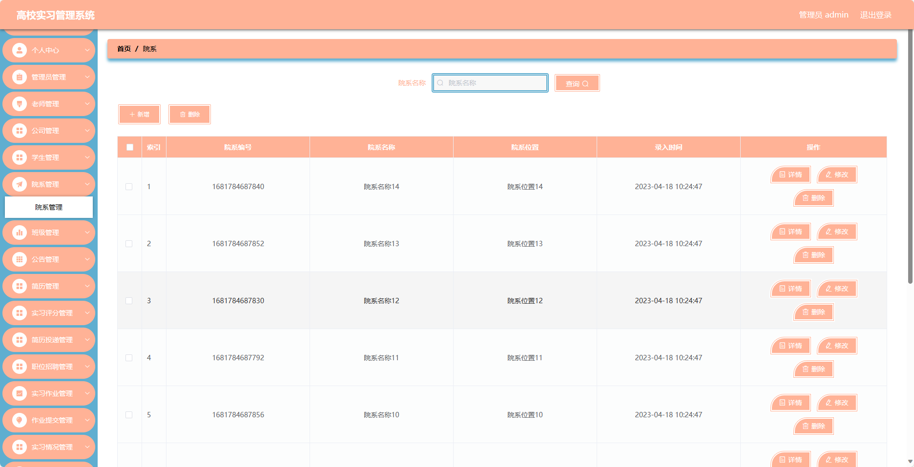
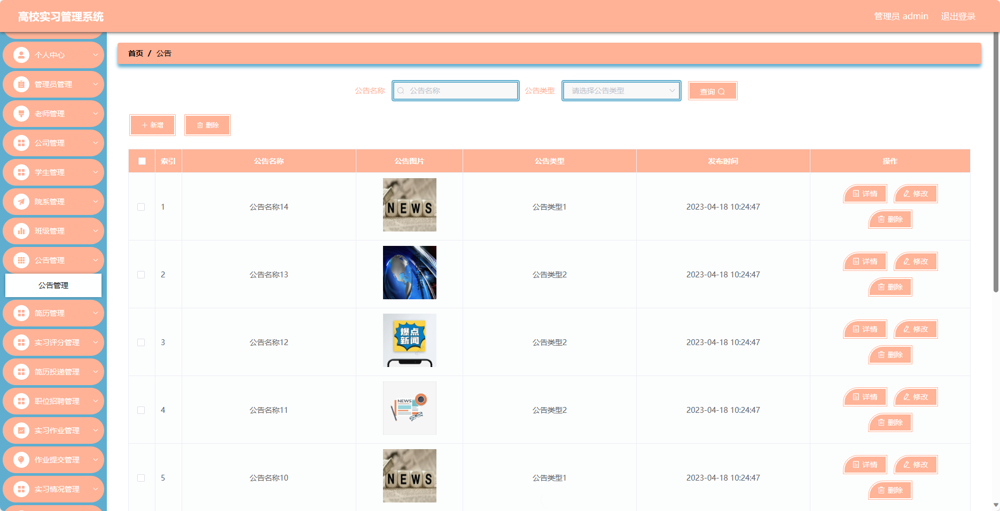
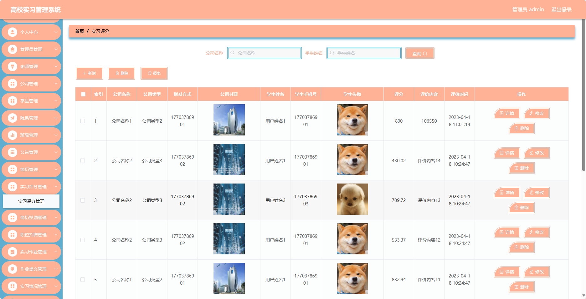
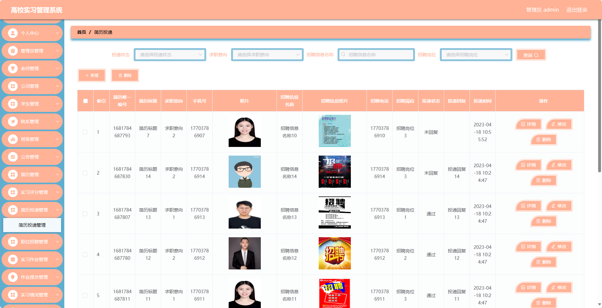
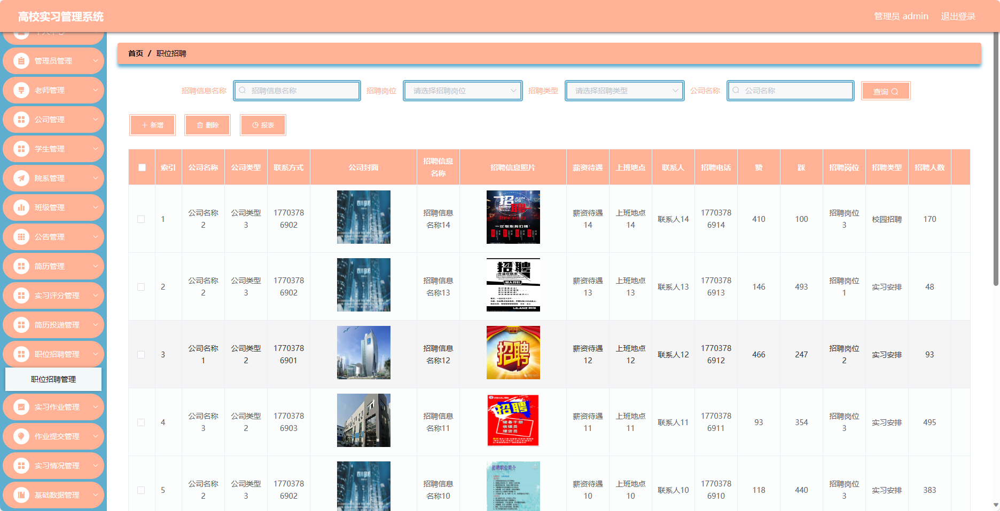
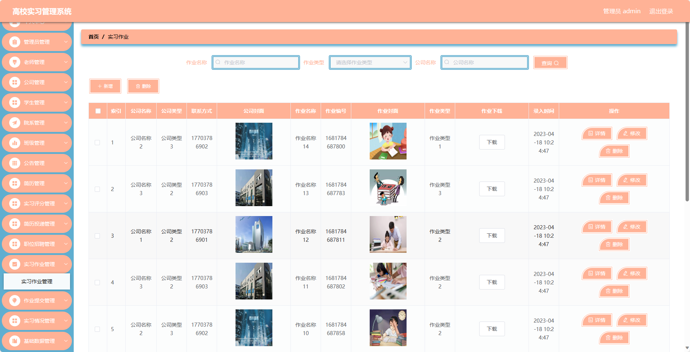
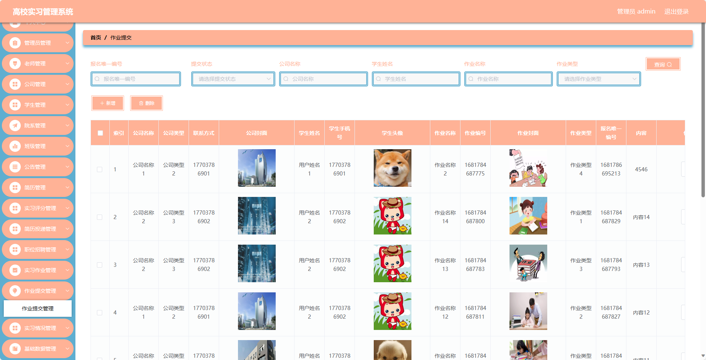
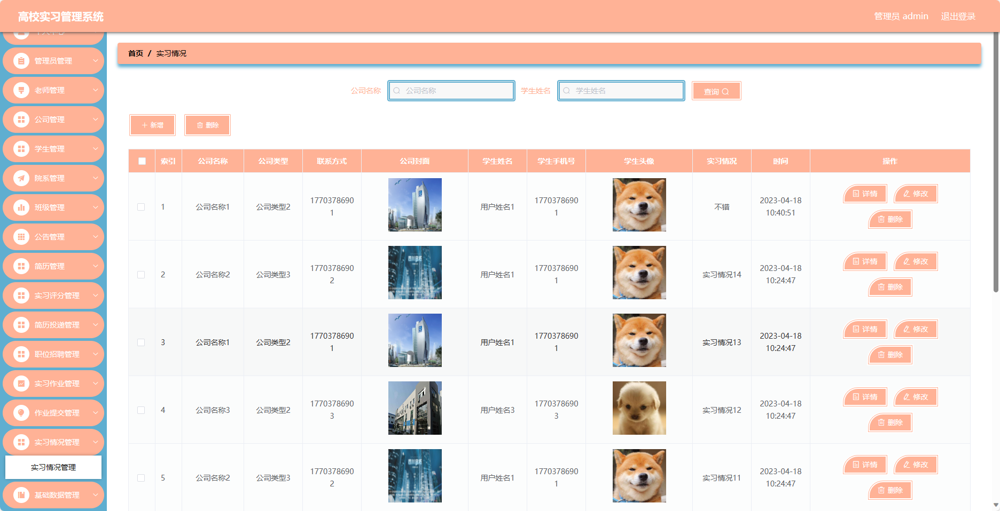

## 基于SpringBoot的高校实习管理系统(程序+报告)

- <b>完整代码获取地址：从戎源码网 ([https://armycodes.com/](https://armycodes.com/))</b>
- <b>技术探讨、资料分享，请加QQ群：692619798</b> 
- <b>作者微信：19941326836  QQ：952045282</b> 
- <b>承接计算机毕业设计、Java毕业设计、Python毕业设计、深度学习、机器学习</b>
- <b>选题+开题报告+任务书+程序定制+安装调试+论文+答辩ppt 一条龙服务</b>
- <b>所有选题地址 ([https://github.com/YuLin-Coder/AllProjectCatalog](https://github.com/YuLin-Coder/AllProjectCatalog)) </b>

## 项目介绍
基于SpringBoot的高校实习管理系统，系统包含四种角色：管理员、公司、用户,主要功能如下。

### 【管理员】:
- 个人中心：管理个人信息。
- 管理员管理：管理系统管理员信息。
- 老师管理：管理教师信息。
- 公司管理：管理实习公司信息。
- 学生管理：管理学生信息。
- 院系管理：管理院系信息。
- 班级管理：管理班级信息。
- 公告管理：发布和管理系统公告。
- 简历管理：管理学生的实习简历。
- 实习评分管理：对学生实习进行评分管理。
- 简历投递管理：管理学生的简历投递情况。
- 职位招聘管理：发布和管理实习职位招聘信息。
- 实习作业管理：管理学生的实习作业。
- 作业提交管理：管理学生的作业提交情况。
- 实习情况管理：跟踪和管理学生的实习情况。
- 基础数据管理：管理系统的基础数据。

### 【老师】:
- 个人中心：管理个人信息。
- 学生管理：管理指导的学生信息。
- 院系管理：管理所属院系信息。
- 班级管理：管理所属班级信息。
- 公告管理：发布和管理班级公告。
- 简历管理：管理学生的实习简历。
- 实习情况管理：跟踪和管理学生的实习情况。
- 实习评分管理：对学生实习进行评分管理。
- 职位招聘管理：发布和管理实习职位招聘信息。

### 【公司】:
- 个人中心：管理个人信息。
- 学生管理：管理实习学生信息。
- 公告管理：发布和管理公司公告。
- 实习评分管理：对实习学生进行评分管理。
- 简历投递管理：管理学生的简历投递情况。
- 职位招聘管理：发布和管理实习职位招聘信息。
- 实习作业管理：管理学生的实习作业。
- 作业提交管理：管理学生的作业提交情况。

### 【学生】:
- 个人中心：管理个人信息。
- 院系管理：管理所属院系信息。
- 班级管理：管理所属班级信息。
- 公告管理：查看和管理公告信息。
- 简历管理：管理个人的实习简历。
- 实习情况管理：查看和管理自己的实习情况。
- 实习评分管理：查看和管理自己的实习评分。
- 简历投递管理：管理个人简历的投递情况。
- 职位招聘管理：查看和申请实习职位。
- 实习作业管理：查看和提交实习作业。
- 作业提交管理：查看和管理作业提交情况。

## 项目技术
- 编程语言：Java
- 数据库：MySQL
- 项目管理工具：Maven
- 前端技术：HTML、CSS、JavaScript、Jquery、Vue
- 后端技术：Spring、SpringMVC、MyBatis

## 运行环境
- JDK版本：JDK1.8及以上
- 开发工具：IDEA、Ecplise、Myecplise都可以
- 数据库: MySQL5.7及以上
- Maven：maven3.0及以上
- Node：14.14.0及以上

## 运行截图

